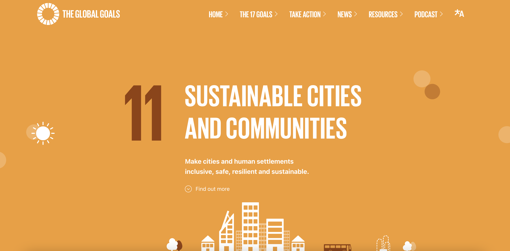

# Sustainable Cities and Communities

## Assignment01

Helen Quach | DH 110 | Fall 2022

### About the project

## Website 1: [The Global Goals](https://www.globalgoals.org/goals/11-sustainable-cities-and-communities/)

### Background Information

The Global Goals website was created by Project Everyone, a not-for-profit agency working together with various organizations in order to publicize information regarding the United Nations’ Sustainable Development Goals. 

### Heuristic Evaluation

_Overall Evaluation_: The website is relatively simple to navigate, although some information is repeated across pages, which can be confusing. The lack of a search bar element makes it difficult to find specific elements on the website in an appropriate amount of time. There is an interesting focus on the aesthetic and branding of the Global Goals, which seems to be equated with news. It may take users a while to learn how to navigate the website and complete their tasks.  

| Heuristic & Description | Evaluation | Explanation | Severity Rating |
| ---- | ---- | ---- | ---- |
| **1\. Visibility of system status** The website presents information about its current status | **Good**: The links in the navigation bar change background color on hover and have a small animation. **Good**: All buttons on the page change color on hover. | The website consistently informs the user what page they are on and when they are hovering on a link. The user is always aware of the website’s current status. | 0 |
| **2\. Match between system and the real world** The website uses familiar language and concepts that users can understand | **Good**: The website provides icons for each of the targets to help users understand what they mean. **Good**: In the menu to change languages, each language is displayed in their respective alphabet or writing system. **Bad**: The “Resources” button links to logo and branding information rather than information on Sustainable Cities and Communities. | A possible solution would be to relocate the logo and branding information link to the bottom of the page and rename the link to “Brand Guidelines.” | 2 |
| **3\. User control and freedom** The website allows users to easily undo their mistakes | **Good**: On the “Resources” page, the website links to another page containing information on the 17 campaigns, in case they were looking for that instead of logo and branding information. **Good**: The website opens “Share This Page” social media links in a small popup window so that users can easily close it if they clicked on the links by mistake. | The website provides methods for users to undo their mistakes, e.g. by redirecting them to the right page.| 0 |
| **4\. Consistency and standards** The website follows platform and industry conventions | **Good**: Clicking on “The Global Goals” at the top and bottom of the website links to the homepage. **Good**: The website features a navigation bar with links to each of the main pages. **Good**: The website contains quick access links to pages in the footer of the website. | The website follows industry conventions by having a navigation bar with a logo that links to the homepage, as well as a footer that contains more extensive links and other information. | 0 |
| **5\. Error prevention** The website prevents users from making errors | **Good**: When attempting to subscribe to the newsletter with an invalid email address, the website prevents the user from subscribing. | The website will not let the user subscribe to the newsletter without providing a valid email, which prevents users from making the mistake of inputting an invalid email. | 0 |
| **6\. Recognition rather than recall** The website presents information that is easily accessible to help users navigate the design | **Good**: Each button on the website has a text label that provides information on what clicking on the button does. **Bad**: Some buttons link to elements on the same page, while other buttons link to different pages, and other buttons link to external websites. | A possible solution would be to explain to the user that external links go to separate websites. The buttons that link to elements on the same page could be removed to avoid confusion when navigating the website. | 2 |
| **7\. Flexibility and efficiency of use** The website offers a good experience to both novice and expert users | **Good**: The website provides shortcuts to various links at the bottom of the page. **Bad**: When changing the language of the website, the website redirects to the homepage rather than staying on the current page. | The website redirecting to the homepage when switching the language may be confusing to novice users. A possible solution would be to have the website remain on the current page when switching the language. It may also be a good idea to have a search bar element that allows users to search for elements that they cannot easily access.| 2 |
| **8\. Aesthetic and minimalist design** The website contains only necessary information and focuses on the essentials                               | **Bad**: The website repeats information and includes the same information on different pages. For example, the “Things to Do” and “Take Action” buttons link to the same information on different pages. | A possible solution would be to reduce the amount of repetitive information by removing it. The “Things to Do” button and the element it links to could both be removed. | 1 |
| **9\. Help users recognize, diagnose, and recover from errors** The website provides error messages that are clear and useful | **Good**: When attempting to subscribe to the newsletter with an invalid email address, the website provides an error message that tells the user what is wrong with the email address. | By providing an error message explaining what is wrong with the email address, the website allows users to correct their mistakes easily. | 0 |
| **10\. Help and documentation** The website offers documentation to help users understand how to use the design if needed | **Good**: The website provides a “Contact Us” page for users linked at the bottom of the website. | There is no need to have extra documentation for how to use this website, so a “Contact Us” page is sufficient. | 0 |

