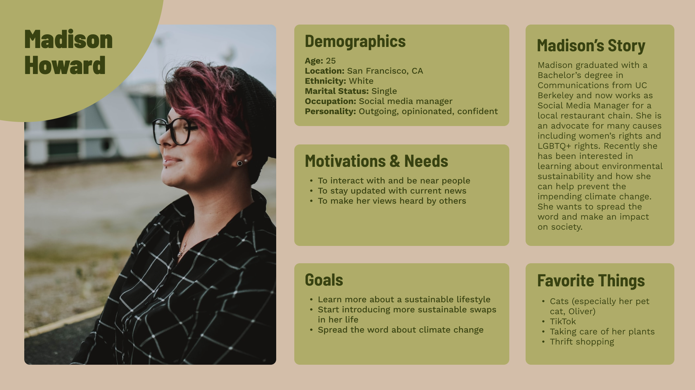
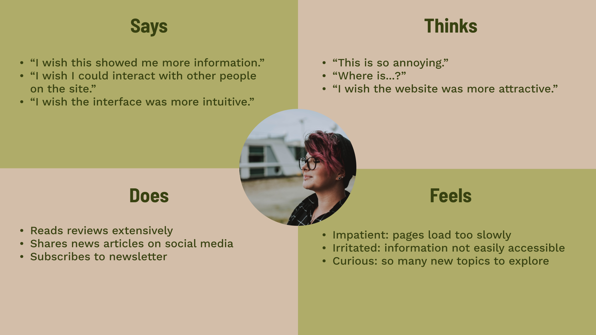
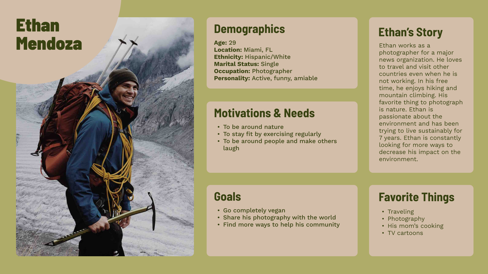
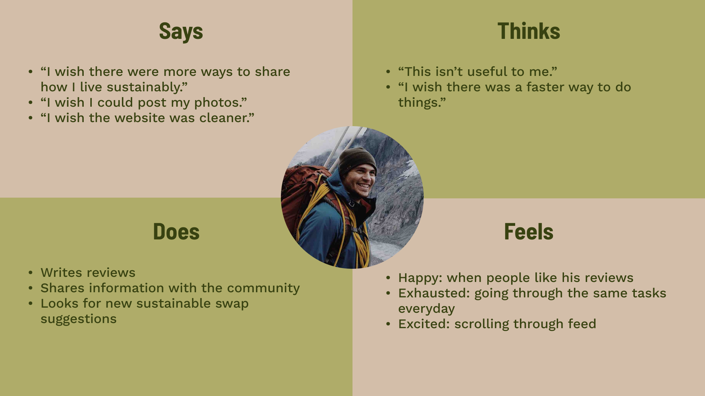
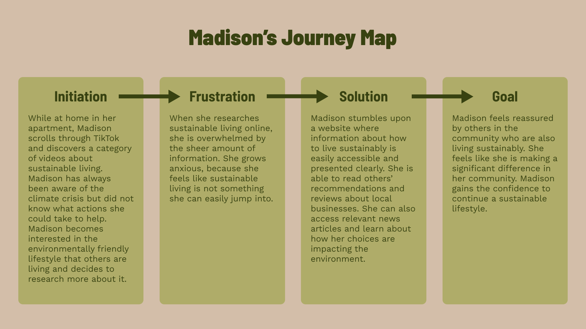
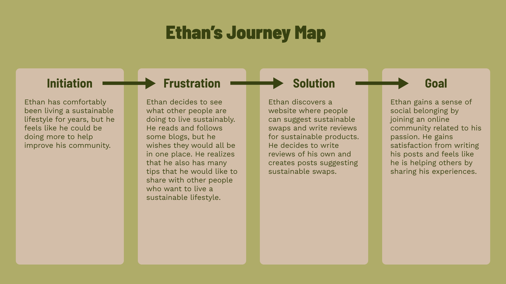

# Assignment 04: Persona + Usage Scenario
Helen Quach | DH 110 | Fall 2022

## The Purpose of UX Storytelling

## Personas and Empathy Maps

### Persona 1: Madison Howard

### Madison's Empathy Map

### Persona 2: Ethan Mendoza

### Ethan's Empathy Map

## Scenarios and Journey Maps

### Madison's Scenario
#### Why Madison uses this product
> Madison recently discovered the world of sustainable living through social media. She has always been aware of climate change, but has never done anything about it because she didn't know what actions she could take. Madison tried researching sustainable living and started to make sustainable swaps in her life, but she felt like her acting alone wasn't making a difference. Madison wants to interact with other people and join a community of people living sustainably in hopes that that will motivate her to continue.

#### How Madison uses this product
> Madison opens her laptop and navigates to the website. She sees previews of recent news articles related to climate change and the environment and decides to read them. Afterwards, she shares one of the articles on her social media account along with her thoughts on the article. On her social media feed, she sees an ad for a local business that sells sustainable soap. Madison navigates back to the website and decides to research the soap business to see if she should buy from them. Madison searches for the business in the search bar and finds a page containing reviews for the business and its products. Noting that the reviews are mostly favorable and many people in her area have been purchasing from them, Madison decides to support the business. She clicks on a link taking her to their online store, where she makes her purchase.

### Madison's Journey Map

### Ethan's Scenario
#### Why Ethan is using this product
> Ethan has been living sustainably for years, both at his home and in countries he visits for his work and adventures. Still, Ethan feels that he could be doing more to help his community.

#### How Ethan is using this product

### Ethan's Journey Map

