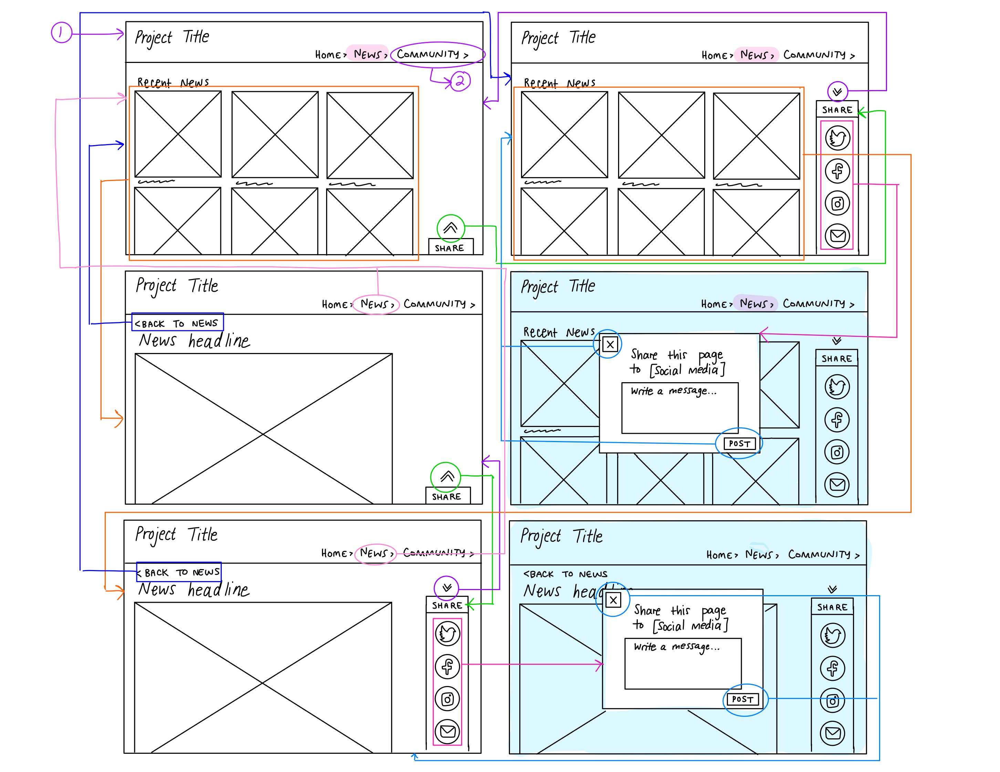
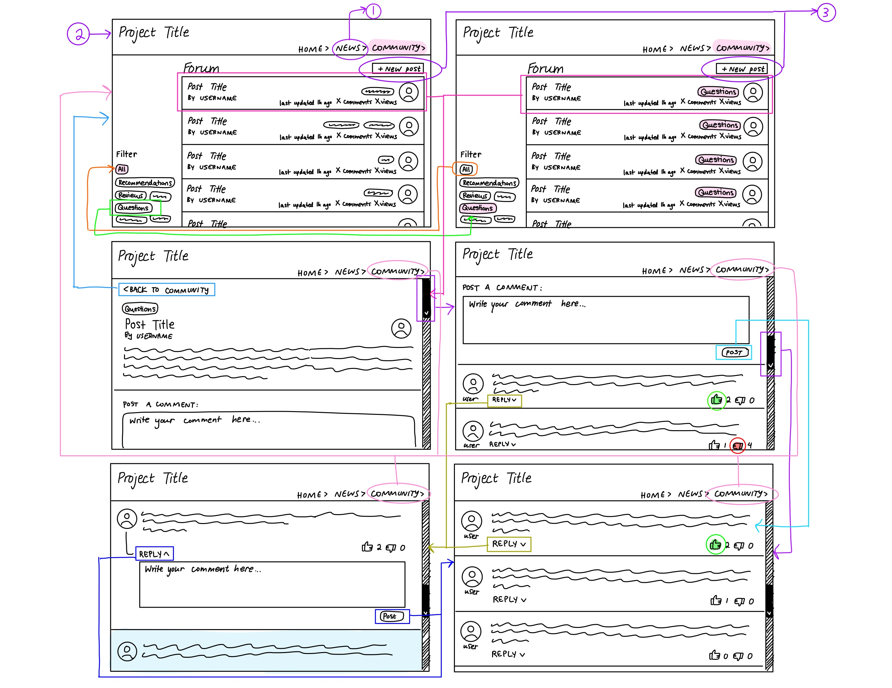
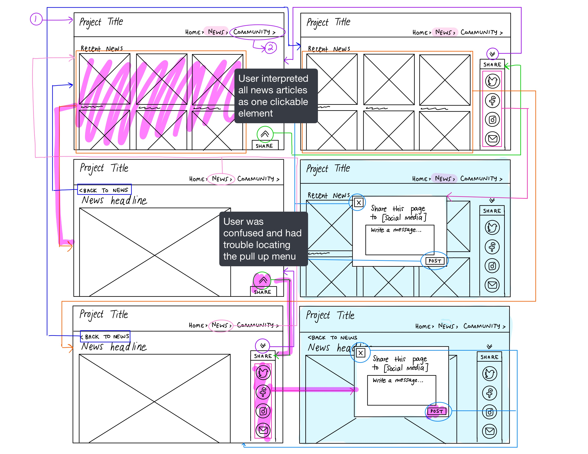
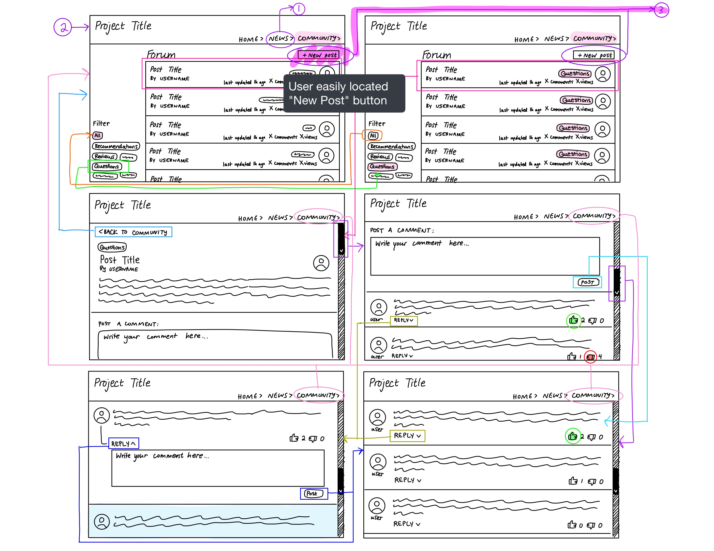

# Assignment 05: Low-Fidelity Prototype
Helen Quach | DH 110 | Fall 2022

## Project Description
This project aims to provide users with the resources to learn about one of the United Nations' Sustainable Development Goals, Goal #11: Sustainable Cities and Communities. The project will have a news page and a community page. The news page will present to the user recent news articles related to Goal #11, the environment, climate change, and sustainable living. The user will be able to share interesting news articles to their social media followers and spread the word about what they learned and want others to learn. On the community page, users will be able to create posts and tag them as Recommendations, Reviews, Questions, etc. The user can recommend tips on how to live sustainably, review local businesses or sustainable products, and ask questions to experts in the community. Users can comment on others' posts, like and dislike comments, and otherwise interact with others in the community.

#### User Research
The target users are young adults who are interested in sustainable living and passionate about the environment. From user research, I have determined that users want to feel reassured by other members in their community that their efforts towards sustainable living are making a difference. Users also want to be able to access relevant news easily and access information about local businesses before committing to supporting them. In addition, experienced users are constantly looking for new ways to live sustainably. 

Here is [more information on user research for this project.](https://github.com/helenquach/DH110-HelenQuach/blob/main/Assignment03/Assignment03.md)

#### Personas + Usage Scenarios
I created two personas for two different usage scenarios:
* A young woman active on social media who is curious about sustainable living and wants to spread the word about climate change
* A young man who wants to share his experiences living sustainably with others in the community

Here is [more information on personas and usage scenarios for this project.](https://github.com/helenquach/DH110-HelenQuach/blob/main/Assignment04/Assignment04.md)

#### Purpose of Low-Fidelity Prototype
The purpose of low-fidelity prototyping is to test the functionality and flow of the design before investing in a fully developed product. I want to see if users are able to intuitively learn how to complete the tasks at first glance of the design. I also want to identify obvious problems in the design that I can potentially fix before developing a more high-fidelity prototype. 

## Tasks
The low-fidelity prototype supports the following tasks: 
1. The ability to read relevant news articles in a curated feed and share them on social media
2. The ability to read/write posts in a community forum about sustainable living where you can recommend products and write reviews on local businesses

## Wireframes and Wireflow

## Prototype Testing

Notes on Prototype Testing: The user was able to successfully complete both tasks.

## Reflection
During prototype testing, the user was initially confused during Task 1, reading a news article and sharing it to social media, and could not locate the pull-up menu for the social media links. However, the user realized their mistake and eventually completed Task 1. Interestingly, the user highlighted all of the news articles and all of the social media links when progressing to the next step of the task. I think this is due to the format of the wireflow, because I boxed all of the elements together instead of boxing each element individually. At this point, I am not sure that it is a flaw with the design. The user completed Task 2, creating a post and publishing it to the community forum, with no problems. When completing Task 2, the user added a photo to their post first and then tagged their post before publishing it. I was glad that the user easily identified the "New Post" button at the top of the community forum page because I worried that the page was too busy or complex for new users. The user had some troubles interpreting the wireflow and what each of the arrows did, but seeing as the user eventually was able to complete both of the tasks successfullly, I do not think this is a problem.

In terms of improvement, I think that I can make the social media links on the news page more obvious. Rather than hiding them on a pull-up menu at the bottom of the screen, I could put all of them in a single container on the right side so that they are always visible. This may be simpler than the pull-up menu and it will still be out of the way of the news articles. On the community page, I could not identify any issues during the initial prototype testing. However, I think that I will add a Search Bar on both of the pages so that it is easier for users to find news articles and posts about topics they want to research. 
