# Assignment 06: Interface Design
Helen Quach | DH 110 | Fall 2022

## Project Description
The goal of this project is to design a website that provides people with the resources to learn about one of the United Nations' Sustainable Development Goals, Goal #11: Sustainable Cities and Communities. The website will feature a News page where users can easily access the latest relevant news regarding environmental sustainability. The website will also feature a social aspect on the Community page, where users can interact with one another in a forum and ask questions about living a sustainable lifestyle, read reviews of local businesses, and recommend tips. I decided to name the website Greenforum (stylized "greenforum") to combine the forum aspect of the website with the "go green" mentality of sustainable living.

### Purpose of interface design
The purpose of interface design is to start the process of digitizing your low-fidelity prototype and develop a design system of fonts, shape, colors, and spacing that you can use in your future designs. In the process, you can also learn how users may perceive your design at first glance and adjust your design as necessary.

### Design process
I used Figma to digitize my low-fidelity prototype. I used the Macbook Pro 14" size for my frames, which is 1512 x 982 pixels. I began by deciding on the spacing of my grid and then laying out the basic shapes from my wireframe, choosing colors as I went. Then I decided on a typography system from a variety of options. I also tested different shapes for the elements on my website such as the news cards and the social media bar. Finally, I tested various color schemes and developed a dark mode color scheme.  

### Example wireframe
Below is the example wireframe that I digitized as part of my interface design.

### Link to prototype
Here is the [link to the Figma file.](https://www.figma.com/file/7bqPEgQ3nS4W1Bl99qofRQ/DH-110-Interface-Design-System?node-id=0%3A1)

Here is the [link to the prototype.](https://www.figma.com/proto/7bqPEgQ3nS4W1Bl99qofRQ/DH-110-Interface-Design-System?node-id=104%3A2495&scaling=min-zoom)

## Screen Design

### Typography variations

I tried a variety of typography options, including sans serif and serif fonts for the headline and body text. The options explored can be seen below.

#### Variation 1: Urbanist

#### Variation 2: Archivo
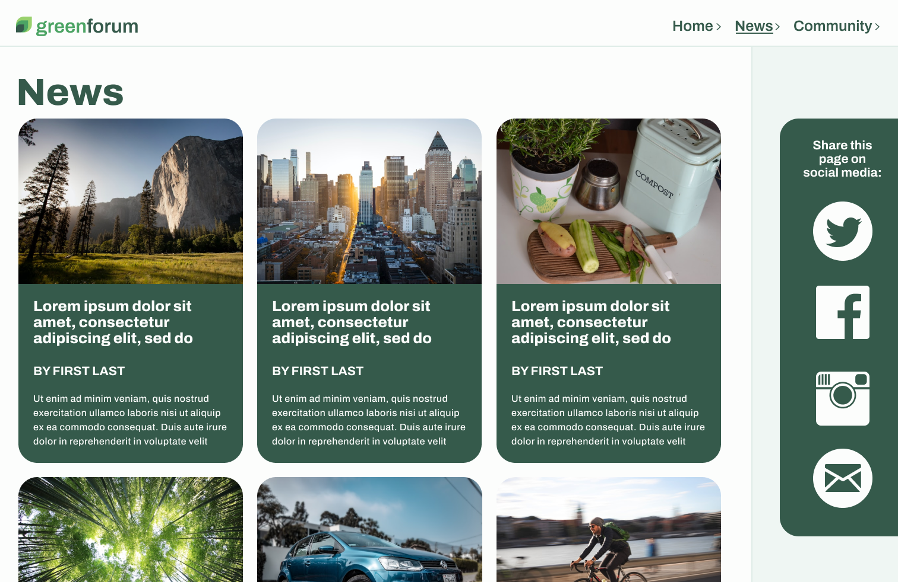

#### Variation 3: Zilla Slab
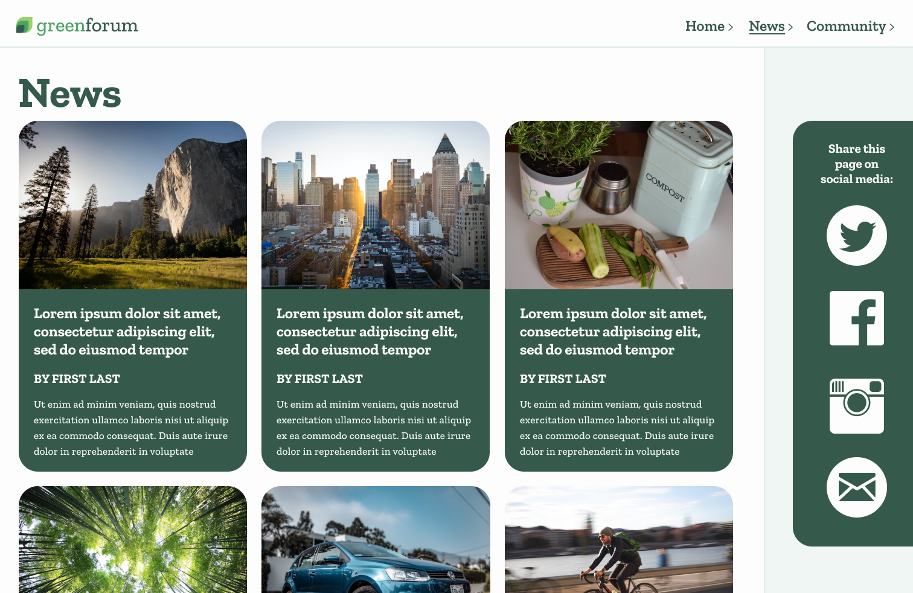

#### Variation 4: Fraunces, Work Sans

In the end, I settled on using the fonts Fraunces for headline text and Work Sans for body text. I used [Material Design](https://m2.material.io/design/typography/the-type-system.html#type-scale) to help generate a type scale for these fonts and adjusted the weights for legibility, as shown below:

|   | Font | Weight | Size | Letter spacing |
| --- | --- | --- | --- | --- |
| Headline 1 | Fraunces | Bold | 108px | -1.5px |
| Headline 2 | Fraunces | Bold | 68px | -0.5px |
| Headline 3 | Fraunces | Bold | 54px | 0px |
| Headline 4 | Fraunces | Bold | 38px | 0px |
| Headline 5 | Fraunces | Bold | 27px | 0px |
| Headline 6 | Fraunces | Bold | 23px | 0px |
| Subtitle 1 | Fraunces | SemiBold | 18px | 0px |
| Body 1 | Work Sans | Regular | 17px | 0.5px |
| Body 2 | Work Sans | Regular | 15px | 0.25px |

For the body text, I used 150% line height.

### Shape variations

I explored different shapes for the news card element and social media bar elements. First I tried rounded rectangles with 32px radius. Then I explored rectangles with 0px radius for sharper corners and a more refined look. I also tried a custom shape with varied radii (32px, 0px) that represents the leaf in the logo that I designed for the website. In the end, I decided to use the rounded rectangles with just 32px radius, because the consistent radius looked more trustworthy.

#### Variation 1: 32px radius
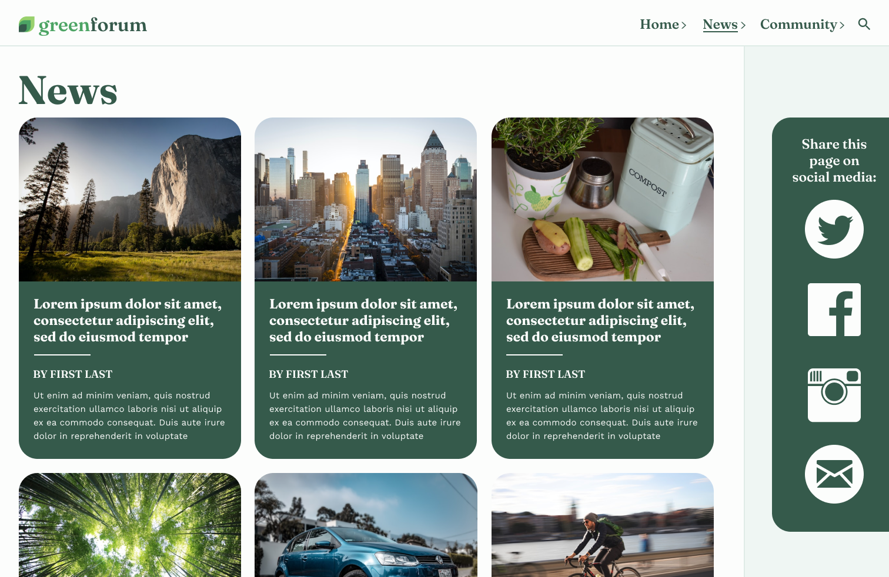

#### Variation 2: 0px radius
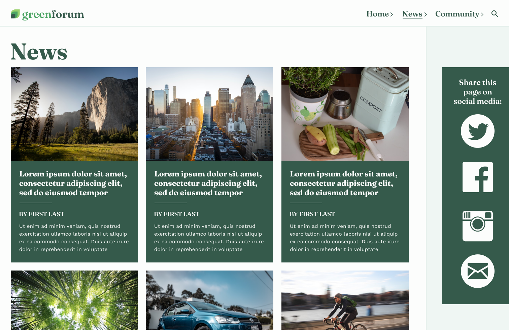

#### Variation 3: Varied (32px, 0px) radius

### Color variations

I initially created a green color scheme for the website to compliment the logo and the name of the website, Greenforum. I experimented with a brown version, since brown and green are often seen together in nature. However, I thought that the green version was more elegant. I also developed a dark mode to compliment the green version of the website, shown below.

#### Variation 1: Green

#### Variation 2: Brown
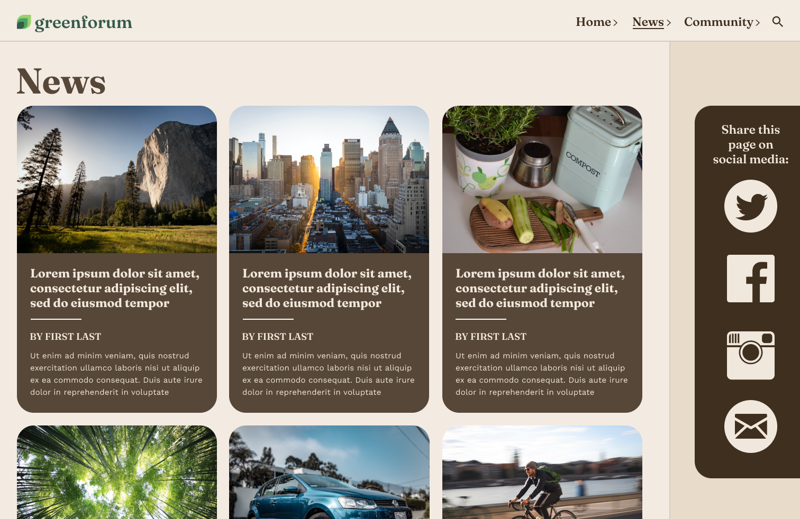

#### Variation 3: Green Dark Mode
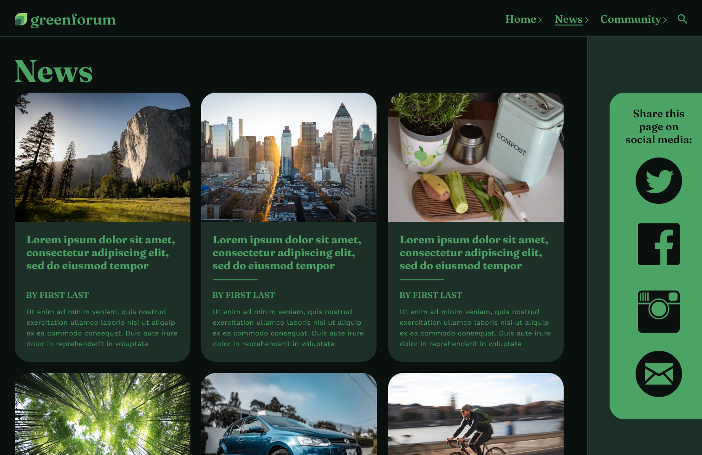

### Layout testing
I designed my layout according to the grid shown below.
* 7 columns, 32px margin, 48px gutter
* 10 rows, 0px margin, 24px gutter

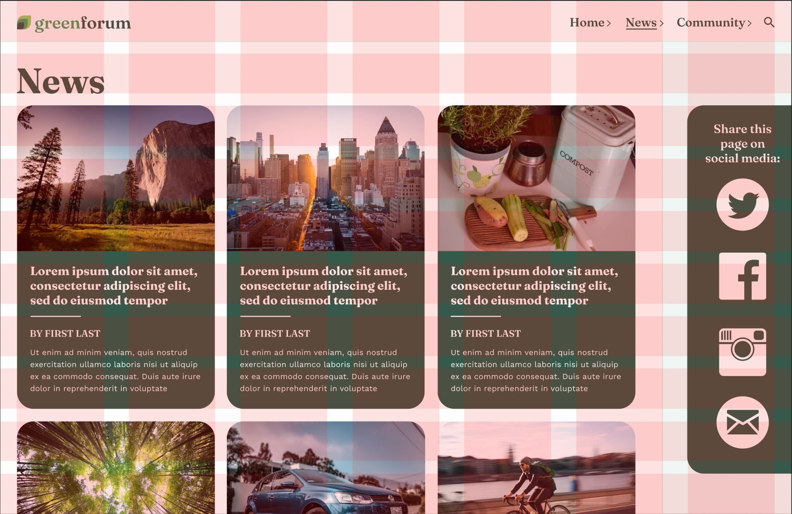

## Impression Test

I showed my prototype to another person for 5 seconds and asked them to recall anything they could remember about the website. Then I gave them the prototype to play around with and asked them for their thoughts on the fonts, colors, layout, and overall design. Here are the results:

### Audio recording
Here is the [audio recording of the impression test.](https://drive.google.com/file/d/1C0qJg82TzCWPy53P63ZdqNgC-h0an03H/view?usp=sharing)

### Transcript
Here is the [transcript of the impression test.](https://docs.google.com/document/d/1yTgQgTlz9ikaSWJ9oqvASm2xmSKX6lkv8ZmoXhUi4uQ/edit?usp=sharing)

### Findings
From the 5-second test:
* Website appears to be about nature
* Overwhelmingly forest green colors
* Social media side bar was very prominent
* Everything was grouped together and organized well
* Three columns, easy to read

Other findings:
* Having elements change color on hover is a useful visual feature
* Should add some kind of interactive element to page numbers at bottom of news articles
* Should make the search icon bigger
* Good contrast between typography choices for headline and body text

## Accessibility Check

I performed color contrast checks for the light mode and dark mode versions of my design. All color combinations of text and background color passed the 4.5:1 ratio test, as shown below.

### Light mode

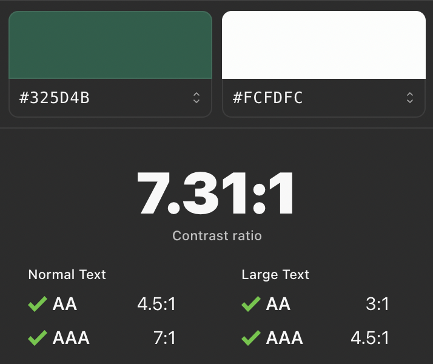
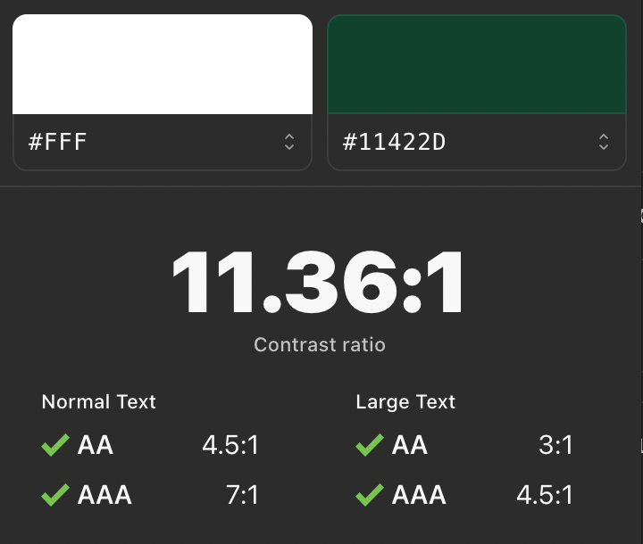

### Dark mode

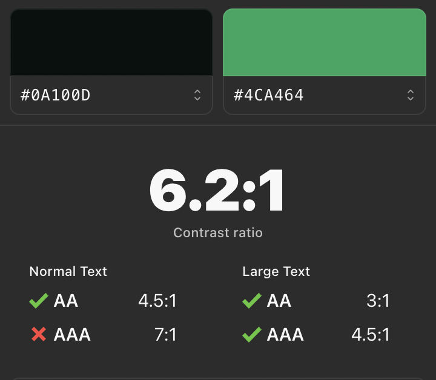
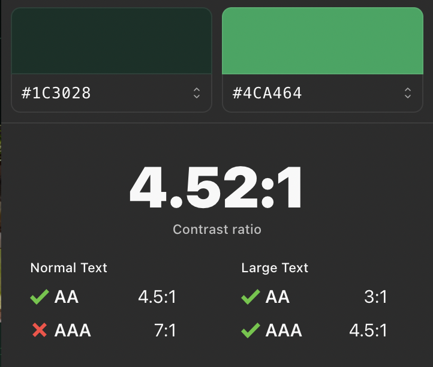

## Design System
### Final prototype
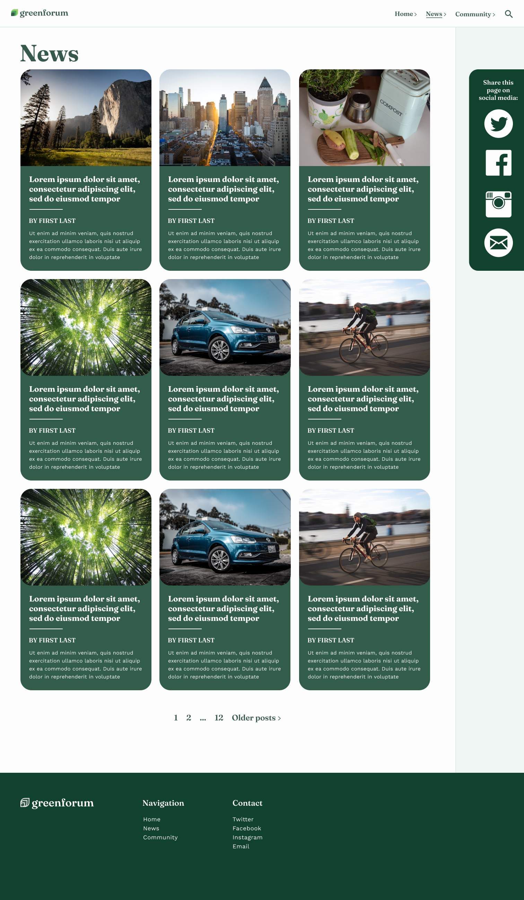
### Layout test
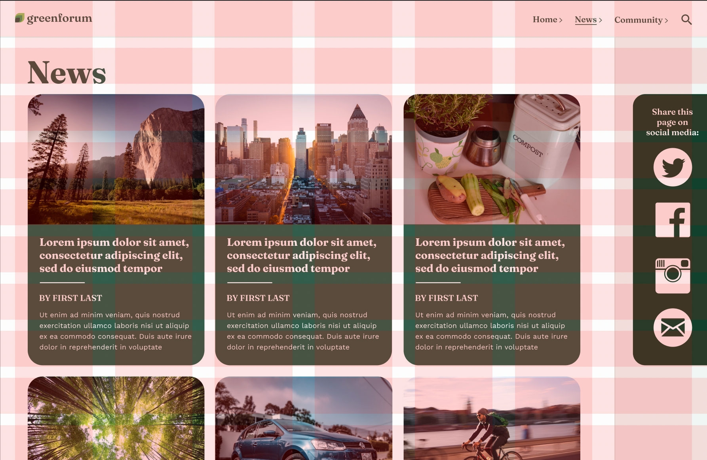
