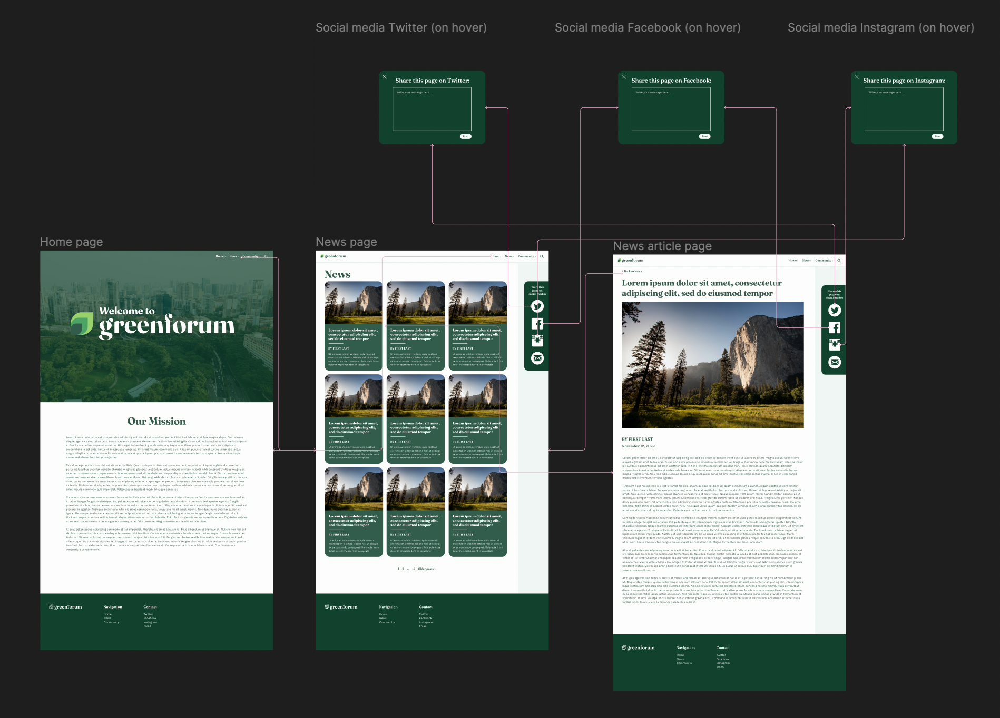
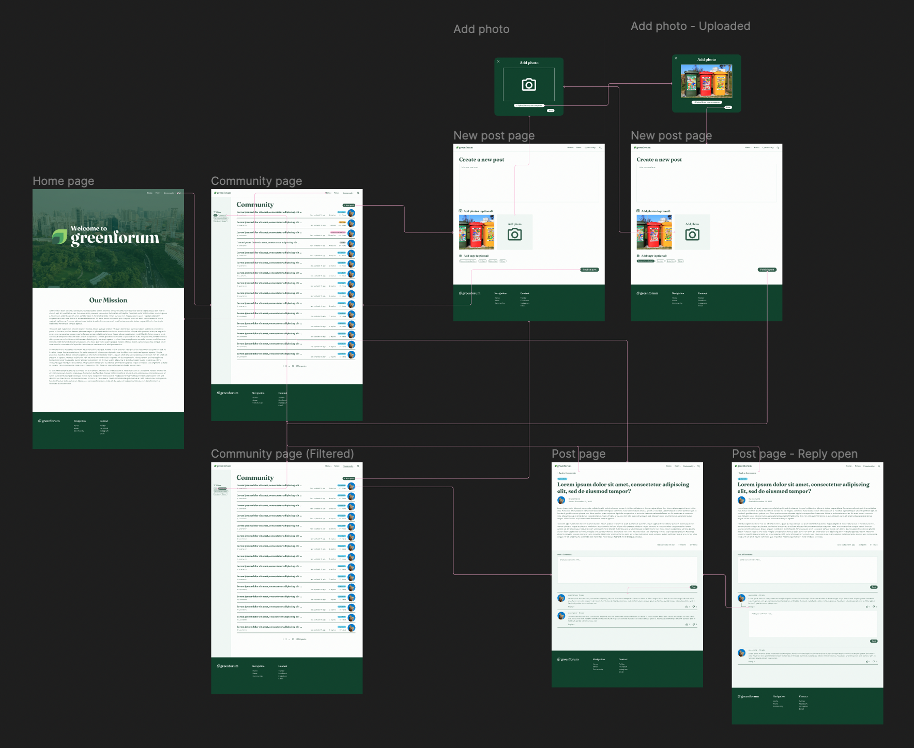

# Assignment 07: High-Fidelity Prototype
Helen Quach | DH 110 | Fall 2022

## Project Description

### Purpose of interactive prototype

### Process of design

### Tasks
The high-fidelity prototype supports the following tasks:
1. The ability to read news articles and share them on social media
> In this task, the user navigates to the News page and looks for a news article. The user clicks on an interesting news article and reads it. Then the user shares the news article to their social media account by clicking on one of the social media logos in the sidebar.
2. The ability to read/write posts in a community forum, filter posts by tags, comment on posts, and reply to comments
> In this task, the user navigates to the Community page and looks for posts. The user filters the posts by the Question tag, so that only the posts tagged with Question are seen. The user clicks on the first post and reads it. Then the user posts a comment. Then the user replies to the first comment on the post. Then the user navigates back to the Community page. The user will then create a new post, uploading a photo and tagging it as Recommendation. The user will publish the post, which will bring them back to the Community page.

## Link to prototype
Here is a [link to the Figma file.](https://www.figma.com/file/RqIQmTZjp8CDBBa9xSuupa/DH-110-High-Fidelity-Prototype?node-id=0%3A1&t=I44rO9CoIGDLds6D-1)

Here is a [link to the prototype.](https://www.figma.com/proto/RqIQmTZjp8CDBBa9xSuupa/DH-110-High-Fidelity-Prototype?node-id=0%3A1&t=I44rO9CoIGDLds6D-1)

## Wireflows
### Task 1: Reading a news article and sharing on social media

### Task 2: Community forum - filtering posts by tag, reading a post, commenting on a post, replying to a comment, and creating a post

## Cognitive Walkthrough

### Summary of findings
